# Gen Z Lab. 2026년 3분기 워크샵 게임 시스템

사내 워크샵(60명 / 10조)용 실시간 레크레이션 웹앱. Kahoot 대체로 만들었다.

**게임 1 — 3 Truths 1 Fake** 조 안에서 자율 진행. 각자 진실 3 + 거짓 1을 쓰고, 조원들이 어느 것이 거짓인지 맞힌다.
**게임 2 — 조 대항 퀴즈** 전체가 동시에 푼다. O/X 4문항 + 4지선다 4문항.

서버는 없다. 프론트는 GitHub Pages, 백엔드는 Supabase(Postgres + Realtime) 하나로 끝낸다.

> **아래 화면은 전부 실제로 앱을 돌려서 캡처한 것이다.** 등장하는 이름·Knox ID·조 이름·문항은 모두 데모용으로 지어낸 가상 데이터이며, 실제 참가자 정보가 아니다.

---

## 실행 시나리오

### 1. 입장 — Knox ID만 치면 끝

명단에 있으면 이름까지 자동으로 채워 바로 입장한다. 없으면 이름을 입력하고 조 배정을 기다린다.
입장하자마자 자기 문장 4개를 쓴다. **저장하는 순간 순서가 한 번 섞여 DB에 박힌다** — 렌더링할 때마다 섞으면 조원끼리 보이는 순서가 달라져 득표 집계가 깨지기 때문이다.

<p>
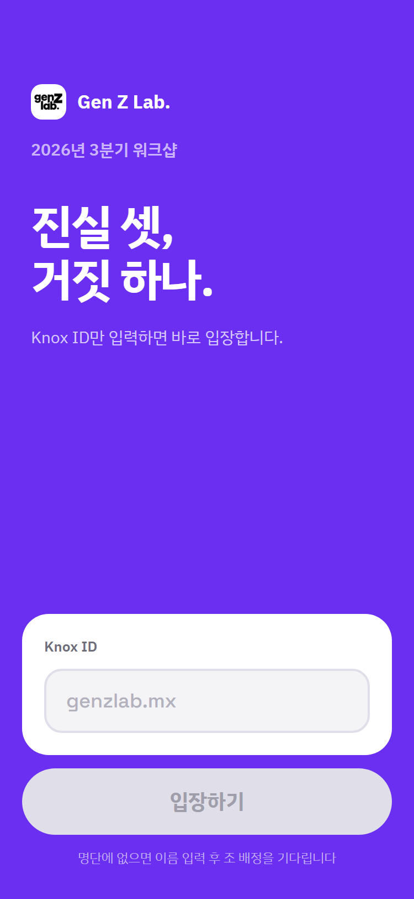
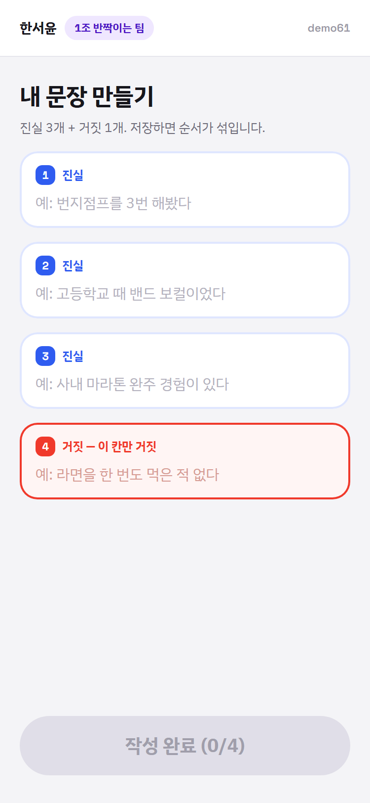
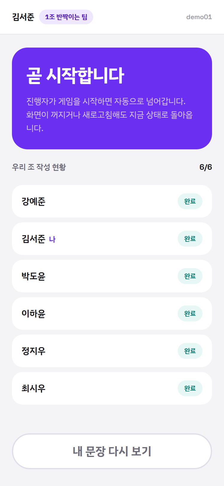
</p>

빔프로젝터에는 QR과 함께 실시간 집계가 뜬다. 진행자는 "몇 명 들어왔고 몇 명이 문장을 다 썼는지"만 보면 된다.

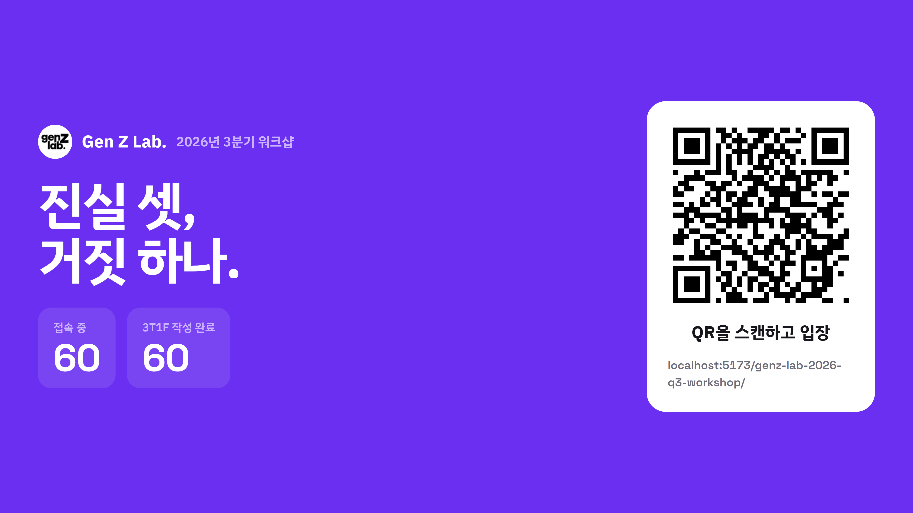

---

### 2. 게임 1 — 3 Truths 1 Fake

조마다 **독립적으로** 진행된다. 발표자가 자기 문장 4개를 말로 설명하고, 나머지 조원이 거짓을 고른다.

| 투표하는 사람 | 발표 중인 사람 |
|---|---|
| 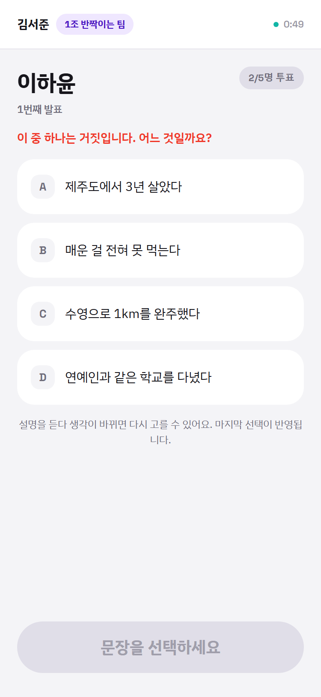 | 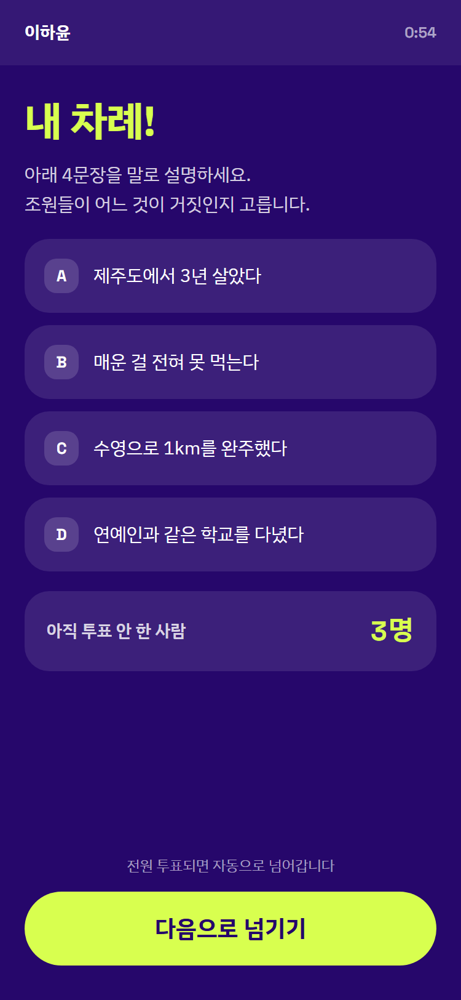 |
| 설명을 듣다 생각이 바뀌면 **다시 고를 수 있다.** 마지막 선택이 반영된다. | 발표자 본인은 배경색이 다르다. 아직 투표 안 한 사람 수가 보이고, 기다리기 싫으면 직접 넘길 수 있다. |

전원이 투표하면 **자동으로** 결과가 열린다. 진실은 파랑, 거짓은 빨강 — 이 색의 의미는 앱 전체에서 고정이다.

<p>
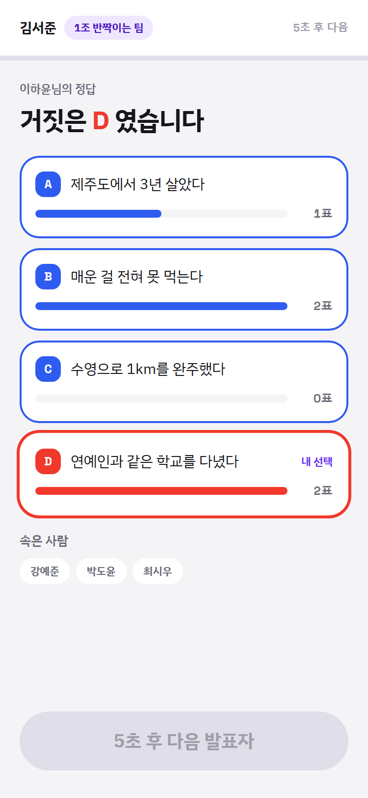
</p>

5초 뒤 다음 발표자로 넘어간다. 이 판정은 **서버의 조회 함수 안에서** 일어나기 때문에, 발표자 폰이 꺼져도 다른 조원의 폴링이 대신 턴을 넘겨준다. 한 명 때문에 조 전체가 멈추는 일이 없다.

스크린에는 10개 조의 진행도가 한눈에 뜬다. 한 발표자에 2분 넘게 머물면 발표자 폰에 "슬슬 다음 분으로!" 배지가 뜨고, 2분 30초를 넘기면 스크린에서 그 조가 빨갛게 반전되어 진행자가 콕 집어 독촉할 수 있다. **시스템이 강제로 끊지는 않는다** — 대화가 한창일 수도 있기 때문이다.

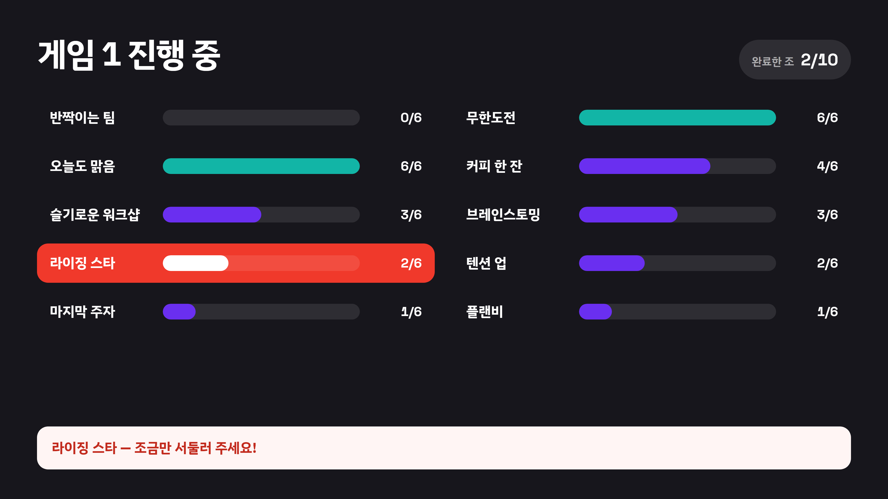

---

### 3. 게임 2 — 조 대항 퀴즈

전체가 같은 문제를 동시에 푼다. 게임 1과 달리 **한 번 제출하면 바꿀 수 없다.**

타이머는 서버가 찍은 시작 시각 기준이다. 각 단말은 남은 시간을 계산해 보여주기만 하고, 채점 유효성도 서버가 판단한다. 폰 시계가 어긋나 있어도 화면이 틀리지 않도록 조회 응답에 서버 시각을 함께 실어 보정한다.

| O/X | 4지선다 |
|---|---|
| 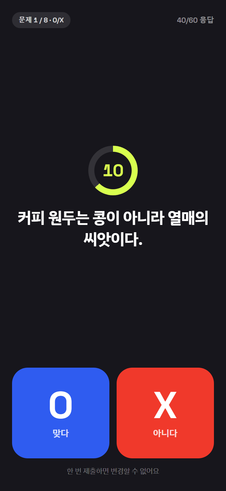 | 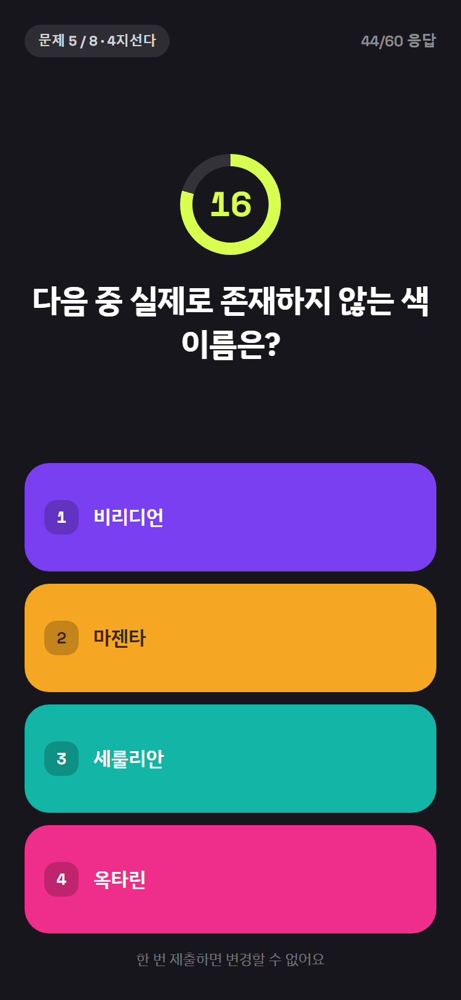 |
| O는 파랑, X는 빨강. 게임 1의 진실/거짓과 같은 의미다. | 4지선다는 **일부러 다른 4색**을 쓴다. 파랑·빨강을 재사용하면 O/X로 착각한다. |

정답이 공개되면 점수 계산 내역과 응답 분포가 함께 나온다. 빨리 맞힐수록 스피드 보너스가 붙는다.

| 참여자 | 스크린 |
|---|---|
| 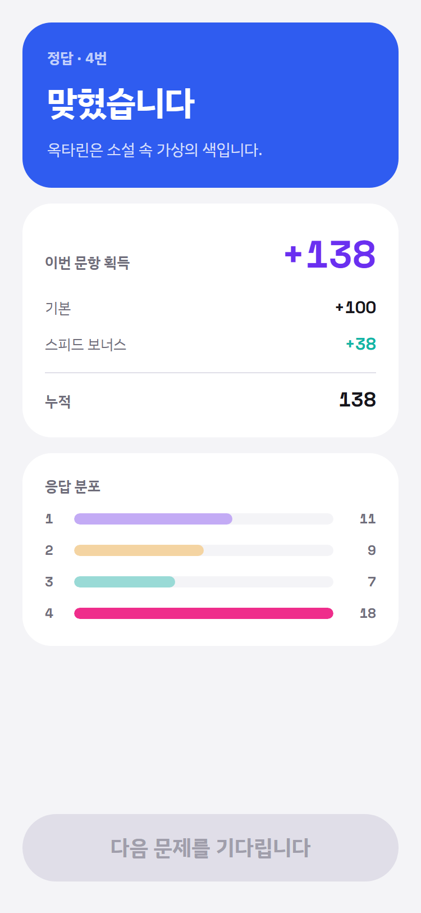 | 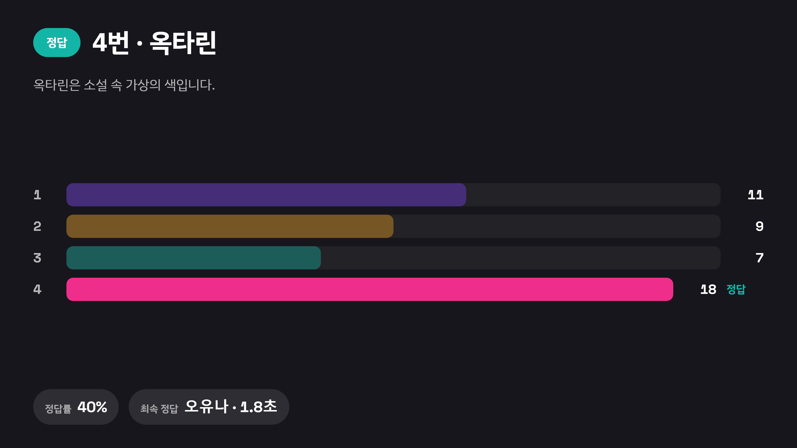 |

문제를 푸는 동안 스크린은 이렇게 보인다.

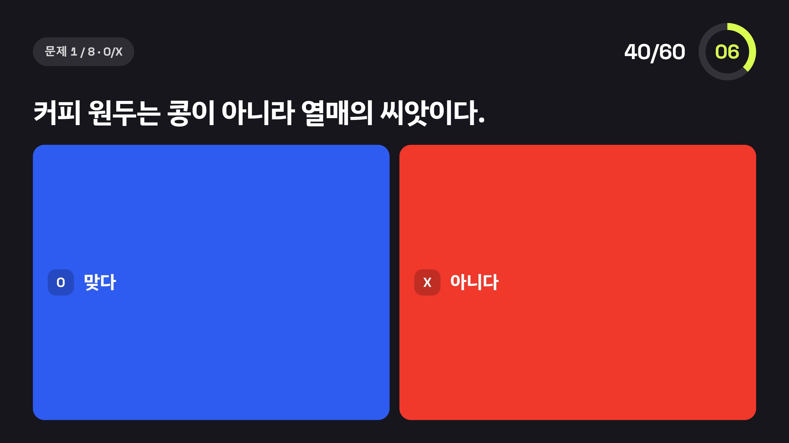

---

### 4. 결과

조 점수는 단순 합계가 아니라 **조원 개인 점수 합 ÷ 게임 2에서 1문항 이상 응답한 조원 수**다. 접속만 하고 잠수한 인원이 분모를 부풀리지 않게 하려는 것이다. 분모는 게임 도중에도 매번 현재 편성으로 다시 계산하므로, 관리자가 조를 옮기면 점수가 알아서 따라간다.

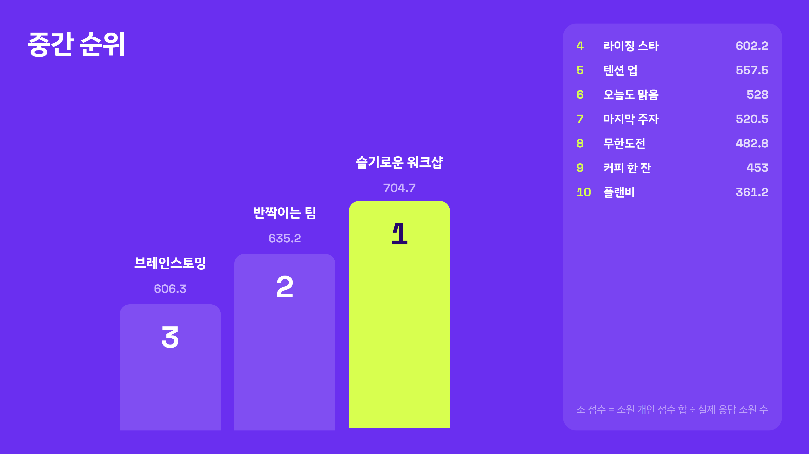

마지막엔 각자 자기 기록을 받는다. 게임 1에서 남의 거짓을 몇 번 맞혔는지, 우리 조에서 누가 제일 잘 속였는지까지 나온다.

<p>
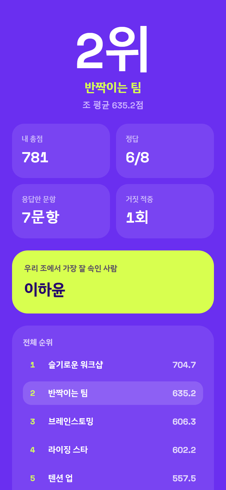
</p>

---

### 5. 진행자용 관리자 화면

`#/admin`으로 들어간다. **권한은 클라이언트에서 판단하지 않는다.** PIN은 서버(RPC)에서 bcrypt로 검증하고, 통과한 요청만 상태를 바꿀 수 있다. 참여자가 이 URL을 알아내도 아무것도 조작할 수 없다.

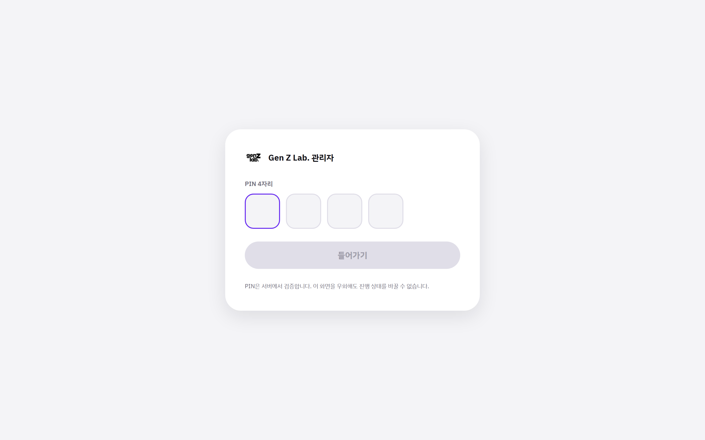

여기서 명단 업로드, 조 편성·이동, 문항 관리, 단계 전환, 공지 배너, 개인정보 삭제를 한다.

---

## 하나의 앱, 세 개의 화면

반응형이 아니라 기준 해상도가 아예 다른 **별도 레이아웃**이다.

| 뷰 | 라우트 | 기준 해상도 | 쓰는 사람 |
|---|---|---|---|
| 참여자 | `#/` | 375 × 812 | 참가자 60명의 폰 |
| 스크린 | `#/screen` | 1920 × 1080 | 빔프로젝터 |
| 관리자 | `#/admin` | 1440 × 900 | 진행자 노트북 |

## 동기화가 도는 방식

`game_state`는 `id=1` **단일 행**이다. 참여자 60명 + 스크린 + 관리자가 전부 이 행 하나를 Realtime으로 구독한다. 관리자가 이 행을 바꾸면 모두의 화면이 2초 안에 전환된다.

```
lobby → game1 → game1_reveal → game2_wait → game2_question
      → game2_answer → leaderboard → final
```

Realtime만 믿지는 않는다. 폰을 켜둔 채로 WebSocket만 조용히 죽는 일이 실제로 있다(LTE 캐리어 NAT 타임아웃). 이때는 `visibilitychange`·`focus`·`online` 중 아무것도 발생하지 않아 재구독 로직이 돌지 않고, 참여자는 멈춘 화면을 계속 본다. 그래서 **폴링 안전망**을 함께 둔다 — Realtime은 빠른 경로(1초 이내)로 두고, 폴링이 최대 5초 안에 따라잡는다.

복구 경로도 같은 이유로 넣었다.

- 폰 화면 꺼짐 → 재조회 + 채널 **재구독**(`channel.state`가 `joined`여도 믿지 않고 무조건 새로 붙는다)
- 새로고침·앱 이탈 → localStorage 세션 + 서버 phase 기준으로 화면 복원
- 지각자 → 언제 들어와도 현재 진행 단계로 합류

## 스택

```
React + Vite + Tailwind + supabase-js
해시 라우터 (GitHub Pages 새로고침 404 회피)
프론트  GitHub Pages · GitHub Actions 자동 배포
백엔드  Supabase 무료 티어 (Postgres + Realtime) — 별도 서버 없음
```

민감한 테이블(`questions` `statements` `votes_3t1f` `answers` `app_config`)은 RLS로 **전면 차단**되어 있다. 정답도, 남의 거짓 문장도, 관리자 PIN 해시도 클라이언트에서 직접 읽을 수 없다. 접근은 전부 `SECURITY DEFINER` RPC를 통해서만 이뤄지고, 공개 시점 제어도 그 안에서 한다.

## 실행

```bash
npm install
npm run dev      # http://localhost:5173/genz-lab-2026-q3-workshop/
npm run build
npm run preview
npm run lint
```

`npm run dev` URL에 **base 경로가 붙는다.** 루트(`/`)로 들어가면 화면이 안 뜬다.

`.env`에 Supabase Project URL과 publishable key가 필요하다. 이 둘은 프론트에 박혀도 되는 공개 값이다.

## DB

`db/`의 SQL을 **번호 순서대로** Supabase SQL Editor에 붙여넣는다.

| 파일 | 내용 |
|---|---|
| `00_reset.sql` | 초기화 — **모든 데이터를 지운다** |
| `01_schema.sql` | 테이블 9개 + PIN 검증 + Realtime |
| `02_rls.sql` | RLS 정책 + 로그인 RPC |
| `03_verify.sql` | 현재 상태 검증 |
| `04~07` | RPC — 3T1F · 게임 1 · 게임 2 · 스크린/관리자 |

`04~07`은 RPC뿐이라 여러 번 실행해도 안전하다(`create or replace`). `01`·`02`는 테이블을 만들므로 재실행하려면 `00_reset.sql`이 먼저다.

## 개인정보

Knox ID와 이름만 수집한다. 행사가 끝나면 관리자 화면에서 지운다. 명단 CSV는 저장소에 커밋하지 않는다(`.gitignore`) — GitHub Pages를 무료로 쓰려면 저장소가 public이어야 하고, 명단이 올라가면 사번과 이름이 그대로 공개된다. 업로드는 관리자 화면으로만 한다.
